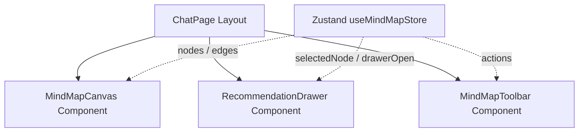

# Technical Specification: Interactive Mind Map UI

This document specifies the architecture, component design, data flows, and layout for the interactive Mind Map UI using React Flow in the right-hand panel of the Clinical Guidelines Assistant application.

## 1. System Architecture

The Mind Map component is built using `@xyflow/react` (v12) for native React 19 compatibility. Canvas state is stored globally in Zustand to allow future integration with the clinical chatbot.



---

## 2. State Management (`lib/mindmapStore.ts`)

A Zustand store manages React Flow's node and edge arrays, node selections, side drawer visibility, and layout actions.

### 2.1 State Schema
```typescript
import { Node, Edge, OnNodesChange, OnEdgesChange } from "@xyflow/react";

export interface MindMapState {
  nodes: Node[];
  edges: Edge[];
  selectedNode: Node | null;
  drawerOpen: boolean;
  
  // React Flow Handlers
  onNodesChange: OnNodesChange;
  onEdgesChange: OnEdgesChange;
  
  // Custom Actions
  selectNode: (nodeId: string) => void;
  closeDrawer: () => void;
  brainstormOnNode: (nodeId: string) => void;
  regenerateMap: () => void;
  clearMap: () => void;
  saveLayout: () => void;
}
```

### 2.2 Default Node Tree (Vertigo Scenario)
The default map represents an acute vertigo triage path:
- **Node 1 (Symptom)**: "Acute Vertigo" (Sun Yellow)
  - **Node 2 (Diagnosis)**: "Benign Paroxysmal Positional Vertigo (BPPV)" (Hot Pink)
    - **Node 3 (Test)**: "Dix-Hallpike Maneuver" (Vibrant Cyan)
      - **Node 4 (Treatment)**: "Epley Maneuver" (Lime Green)
  - **Node 5 (Diagnosis)**: "Vestibular Neuritis" (Hot Pink)
    - **Node 6 (Test)**: "HINTS Assessment" (Vibrant Cyan)
      - **Node 7 (Treatment)**: "Vestibular Rehabilitation" (Lime Green)

---

## 3. UI Components

### 3.1 Custom Node Component (`components/mindmap/CustomNodes.tsx`)
Custom nodes render with strict Neo-brutalist styling:
- **Borders**: `border-[3px] border-black`
- **Shadow**: `shadow-[4px_4px_0px_0px_#000]`
- **Interactive States**: Hover elevates shadow (`hover:-translate-x-0.5 hover:-translate-y-0.5 hover:shadow-[5px_5px_0px_0px_#000]`), Active resets translation.
- **Node Types**:
  - `symptom`: Background `#FACC15` (Sun Yellow)
  - `diagnosis`: Background `#D946EF` (Hot Pink)
  - `test`: Background `#06B6D4` (Vibrant Cyan)
  - `treatment`: Background `#A3E635` (Lime Green)

### 3.2 Recommendation Drawer (`components/mindmap/RecommendationDrawer.tsx`)
Slides in from the right edge of the Mind Map pane:
- Displays detailed guideline text.
- Standardizes references citing the **Ministry of Health (MOH) of Egypt**.
- Houses a physical button "Brainstorm on this" which triggers `brainstormOnNode`.

### 3.3 Toolbar (`components/mindmap/MindMapToolbar.tsx`)
Positioned at the top of the canvas, containing:
- **Regenerate Map**: Reloads initial vertigo nodes.
- **Clear Map**: Empties canvas.
- **Save Layout**: Triggers a mockup success banner.

---

## 4. Interaction Flows

### 4.1 Drawer Selection Flow
1. User clicks a node on the canvas.
2. React Flow triggers selection -> Zustand sets `selectedNode` and `drawerOpen = true`.
3. The drawer transitions into view from `right: 0` with a spring-like css slide.

### 4.2 Dynamic Node Appending (Brainstorm Action)
1. In the drawer, user clicks **Brainstorm on this**.
2. Zustand adds 1-2 new child nodes (e.g. additional diagnostic test or treatment option) to the `nodes` array:
   - **X Coordinate**: Parent X + 220px (offset to the right).
   - **Y Coordinate**: Parent Y + (index * 120px) (staggered vertically).
3. Adds a connecting edge from the parent node to the new child node.
4. Canvas viewport centres/pans to accommodate the new nodes.

---

## 5. Styling Specs

We use Tailwind utility classes mapping to standard Neo-brutalist custom theme tokens:
- **Yellow**: `bg-[#FACC15]` / `text-black`
- **Pink**: `bg-[#D946EF]` / `text-black`
- **Cyan**: `bg-[#06B6D4]` / `text-black`
- **Green**: `bg-[#A3E635]` / `text-black`
- **React Flow Edges**: Standard styles overridden with `strokeWidth: 3`, `stroke: '#000000'`.
- **Canvas Grid**: Uses React Flow's `<Background variant="dots" color="#000000" gap={20} size={1} />`.
